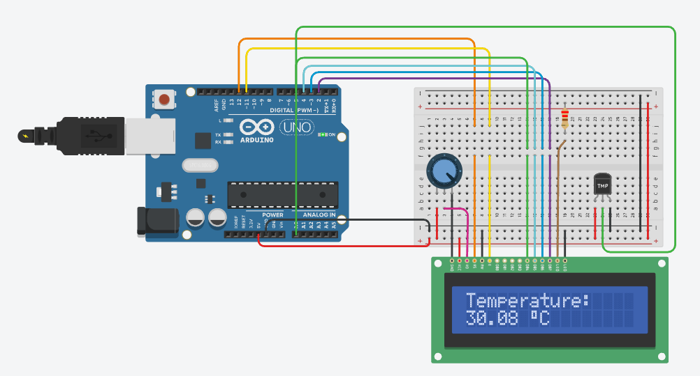

# weather-station
## **Arduino Controlled Weather Station**

Using an Arduino Nano, DHT11 Temperature Sensor and 1602 LCD, I constructed this simple weather station that displays the current temperature (in degrees Celsius) and humidity percentage. 

Using the *DHT* and *LiquidCrystal* libraries made the process of reading and displaying data very simple.

One of the more noteworthy aspects of the *LiquidCrystal* library is the ability to create custom characters to display on the LCD. By creating an array of eight bytes, any character that can be created using a 5x8 grid can be displayed on the LCD using the *createChar* and *write* functions. I used this to create the 'degrees' symbol to display alongside the temperature. 